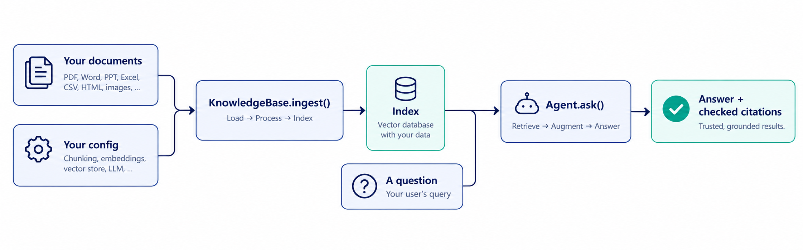

|  |
|:-:|
|  |

# heka-rag-sdk

**Point it at a folder of documents and a config file. Get back an agent that answers questions with
citations checked against the source text, declines when it doesn't know, and can be measured — not just
trusted.**


A configurable RAG (retrieval-augmented generation) SDK for Python. Every stage — how documents are read,
how they're chunked, which model answers, which vector store holds the index, what safety checks run — is a
named, swappable choice in one config file. No stage is hardcoded into your application code.

## Architecture

![heka-rag-sdk architecture: document inputs (PDF, Word, PowerPoint, Excel, CSV, HTML, scanned images, a config file) feed the SDK core (KnowledgeBase + Agent, a stable Python API), which sits on a registry of pluggable adapters (loaders, chunkers, embedders, vector store, retriever/reranker, guardrails, LLM, tracer/cache), each backed by real providers (Gemini, Groq, Claude, OpenAI, Ollama; the local store and Qdrant; and more via the plug-in interface), producing an answer with verified citations, usage and a trace, reachable over the Python API, the CLI or the REST server.](docs/images/architecture.png)

`KnowledgeBase` and `Agent` are a thin, stable API over a registry of small, swappable adapters — one per
pipeline stage (`heka.rag.interfaces`). Nothing in your application code depends on which model, vector
store or loader you picked: change a `provider` in config and the rest of the system doesn't move. See
[Plug-ins](docs/PLUGINS.md) for how a new adapter — yours or a third party's — joins that registry.

### The pipeline, one level deeper

Every step after retrieval and answering is optional and off by default; every step leaves a `TraceEvent`,
and every model call for one question is summed (and priced) into `answer.usage`.


```yaml
retrieval:
  mode: hybrid                   # dense | sparse | hybrid
  reranker: {provider: local_cross_encoder, params: {model: BAAI/bge-reranker-base}}
  condense_followups: true       # +1 model call, only when there is history
chunker: {provider: parent_child, params: {parent_size: 3200, child_size: 400}}
knowledge:
  extraction: layout             # PDF tables become Markdown tables
  ocr: {provider: rapidocr}      # read scanned pages and image files
```

More of the pipeline's config surface, including the full retrieval/chunker/store options, lives in
[Configuration](docs/CONFIGURATION.md).

## See it work

```python
from heka.rag import Agent, KnowledgeBase, RAGConfig

config = RAGConfig.preset(
    "free-tier-dev",  # local embeddings + Gemini; also: high-accuracy, low-cost, on-prem
    name="HR Assistant",
    instructions="Answer employee questions about company policy. Escalate to hr@example.com if unsure.",
    knowledge={"sources": [{"location": "./docs/hr", "metadata": {"department": "hr"}}]},
)

kb = KnowledgeBase(config)
kb.ingest()  # incremental: only new, changed or removed files are processed

agent = Agent(kb, config)
answer = agent.ask("How many casual leave days do I get?")

print(answer.text)
for c in answer.citations:  # each quote was verified to appear verbatim in the cited source
    print(c.source, c.location, "-", c.quote)
```

That's the whole shape of it:



`ask`/`ingest` are sync wrappers over `aask`/`aingest` (async is the core). Pass `history=[...]` for
follow-up questions and `context=RequestContext(...)` to say who is asking.

## Why heka-rag-sdk?

Building a document Q&A bot by hand usually goes the same way:

| | The problem | What heka-rag-sdk does about it |
| :-: | --- | --- |
| 🎯 | "I built a RAG prototype, but every answer might be a hallucination and I have no way to prove otherwise." | Every citation's quote is mechanically checked against the source chunk before it reaches you — a wrong-but-confident answer gets caught, not shipped. |
| 🔌 | "My code assumes one model and one vector database, so switching either means a rewrite." | Every stage — loader, chunker, embedder, vector store, model, reranker — is a `provider` in a config; switching one is a one-line change. |
| 🔐 | "Access control got bolted on after the fact, and now it's a security review." | Access control is enforced **inside retrieval**: the model never sees a chunk the caller isn't allowed to read. |
| 📊 | "'Is it actually working?' has no real answer — we'd have to build eval tooling ourselves." | A built-in evaluation runner scores retrieval, correctness, groundedness and abstention, with confidence intervals. |
| 🧩 | "Every new use case means another custom pipeline." | An agent is just a folder of documents plus a config file — a second agent is a second folder, zero new code. |

## Use cases

| | Use case | What it looks like |
| :-: | --- | --- |
| 🏢 | **HR & employee policy assistant** | Point it at the handbook, leave policy and benefits guide; employees ask in plain English and get a cited answer instead of opening an HR ticket. |
| 🛠️ | **IT helpdesk / internal support bot** | Runbooks, on-call docs and past incident write-ups become a first line of support that cites the exact step, and hands off what it can't answer. |
| 💬 | **Customer support knowledge base** | Product docs, FAQs and release notes answer customers directly, with access control so a free-tier customer never sees an enterprise-only article. |
| ⚖️ | **Legal & compliance Q&A** | Policies answered with verified quotes legal can check, restricted by department with the same access control used everywhere else. |
| 💼 | **Sales & proposal enablement** | Pricing sheets, case studies and battlecards turned into an assistant reps can ask mid-call, guardrailed off unapproved topics. |
| 🧑‍💻 | **Engineering / internal API docs** | Runbooks and API references queried from a CLI or a REST endpoint your own tools call — no leaving the terminal. |

## What you get

| | Feature | What it means |
| :-: | --- | --- |
| 📄 | **Any document format** | PDF (with table extraction and OCR for scans), Word, PowerPoint, Excel, CSV, HTML and scanned images — one loader per format, the same pipeline after that. |
| ✅ | **Verified answers** | Every citation is checked against the real source text; questions the documents can't answer get a decline with a reason instead of a guess. |
| 🔀 | **Switch providers freely** | Gemini, Groq, Claude, OpenAI, or a local Ollama model; the built-in local store or Qdrant; local or hosted embeddings — one `provider` field, no code changes. |
| 🛡️ | **Production controls, all optional** | Access control and multi-tenancy, PII/injection/topic guardrails, answer verification, tracing, cost tracking and budgets — off by default. See [Access control & guardrails](docs/ACCESS_CONTROL_AND_GUARDRAILS.md). |
| 📈 | **Measure it, don't guess** | A built-in evaluation runner (retrieval hit/recall/MRR, correctness, groundedness, abstention, 95% confidence intervals) and an ablation runner. See [Evaluation](docs/EVALUATION.md). |
| 🌐 | **A REST server when you need one** | `heka-rag serve` puts a JWT/API-key-authenticated HTTP layer in front of any agent, for callers that aren't Python. See [the REST server](docs/SERVER.md). |

## A second agent is a second folder and config

`examples/hr_agent` and `examples/onboarding_agent` are the same code pointed at different documents and
config files — no branching, no per-agent code path. `examples/hr_agent/hr-secure.yaml` turns on every
production control below from config alone, same code again.

## We measured it, honestly

Most RAG toolkits assert accuracy; this one publishes what was actually run, and what wasn't:

* **644 offline tests** (no network, no API keys) cover the pipeline logic itself.
* **Run live, once, on Groq's free tier:** grounded generation with verified citations, abstention, the LLM
  judge, follow-up condensation, query rewriting, answer verification, the agentic retrieval loop, and the
  REST server (a real process, called over HTTP) — a 26-question HR example scored correctness 0.98,
  groundedness 1.00, with every unanswerable question correctly declined.
* **Never yet run against a live service:** Claude, OpenAI, Ollama, the LLM reranker, a remote Qdrant server,
  a real OpenTelemetry backend. Treat your first run on one of these as a test of that adapter.
* A real, 59-page IRS PDF (not written for this SDK) went from 1 detected heading to 296 once the
  layout-aware PDF reader landed, with zero new problems in the document health report.

One model and mostly-synthetic question sets prove the plumbing, not general accuracy — measure your own
documents and questions (`heka-rag eval run`, see [Evaluation](docs/EVALUATION.md)) before trusting a
number. Full methodology, benchmark tables and the "what wasn't verified" list are there too.

## Install

The package is not on a package index yet, so install it from this repository's release. Both commands
below were tested in clean environments with no GitHub login:

```bash
# From the git tag:
pip install "heka-rag-sdk[pdf,local,gemini] @ git+https://github.com/preet893700/heka-rag-sdk.git@v0.1.0"

# Or from the wheel attached to the release (check it against the SHA-256 in the release notes):
pip install "heka-rag-sdk[pdf,local,gemini] @ https://github.com/preet893700/heka-rag-sdk/releases/download/v0.1.0/heka_rag_sdk-0.1.0-py3-none-any.whl"
```

`[pdf,local,gemini]` above is just an example combination; the full extras table (PDF, OCR, Office, HTML,
each model provider, Qdrant, the REST server, ...) is in [Configuration](docs/CONFIGURATION.md). Use `[all]`
for everything. Once the package is published to a private index (see [Releasing](docs/RELEASING.md)), the
install becomes simply `pip install "heka-rag-sdk[pdf,local,gemini]"`.

The source is publicly readable, but the licence is proprietary: reading it grants no right to use, copy,
modify or distribute it (see `LICENSE`).

## Command line

```
heka-rag ingest  -c examples/hr_agent/hr.yaml
heka-rag ingest  -c examples/hr_agent/hr.yaml --report-only                   # how was each document read?
heka-rag inspect -c examples/hr_agent/hr.yaml "can I work from home?" -k 3   # what the model would read
heka-rag ask     -c examples/hr_agent/hr.yaml "How many casual leave days do I get?"
heka-rag eval check examples/hr_agent/questions.jsonl                         # dataset health
heka-rag eval run -c hr.yaml -d questions.jsonl --retrieval-only              # no LLM, no key
heka-rag eval run -c hr.yaml -d questions.jsonl --baseline old/report.json    # full run, compare
heka-rag eval ablate -c bench.yaml -d questions.jsonl --variants v.yaml --retrieval-only -k 3
heka-rag eval gen -c hr.yaml -o questions.jsonl --count 30      # draft a starter question set
heka-rag serve -c hr.yaml --auth jwt                             # REST server (heka-rag-sdk[server])
```

## Go deeper

* [Configuration](docs/CONFIGURATION.md) — every install extra, the full config surface, built-in providers,
  API keys and `.env` loading, writing your own adapter
* [Access control & guardrails](docs/ACCESS_CONTROL_AND_GUARDRAILS.md) — multi-tenancy, PII/injection/scope
  guardrails, answer verification, tracing, cost tracking and budgets
* [The REST server](docs/SERVER.md) — endpoints, authentication, security decisions, what's not included
* [Evaluation](docs/EVALUATION.md) — metrics, reading a report honestly, checking how documents were read,
  drafting a starter question set, and the full benchmark numbers
* [Plug-ins](docs/PLUGINS.md) — writing and registering your own loader, store, guardrail or any other stage

## Known limitations

Only Groq has been exercised live end-to-end; pgvector isn't built yet (Qdrant and the local store are);
guardrails are deterministic pattern-matching, not a security boundary; OCR and PDF table/heading detection
are heuristics tested against a real corpus, not a guarantee against every possible PDF. Full list, and the
roadmap, in [Known limitations & roadmap](docs/LIMITATIONS_AND_ROADMAP.md).

## Development

```
python -m venv .venv
.venv\Scripts\python -m pip install -e ".[dev]"
.venv\Scripts\python -m pytest          # no network or API keys needed
.venv\Scripts\python -m ruff check .
.venv\Scripts\python -m mypy
python examples/benchmark/build_benchmark.py   # regenerate the benchmark (deterministic)
```

Real company documents and question sets belong in `data/`, which is git-ignored, as are the `.heka-rag/`
index folders. Building, versioning and publishing to a private index are in
[Releasing](docs/RELEASING.md); changes are recorded in `CHANGELOG.md`. The licence is proprietary (see
`LICENSE`).

---


